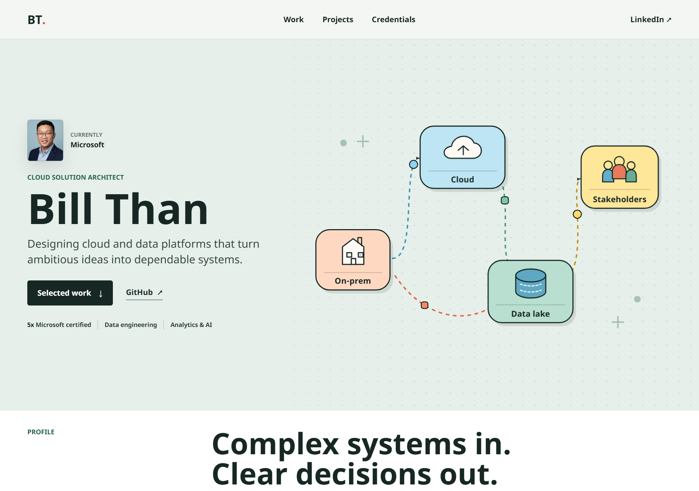

# Bill Than | Portfolio

[](https://github.com/billthan/bthan-portfolio/actions/workflows/ci.yaml)
[](https://github.com/billthan/bthan-portfolio/actions/workflows/publish-gem.yml)

A responsive Jekyll portfolio for Bill Than, a Cloud Solution Architect at Microsoft and Master of Management in Artificial Intelligence candidate at Smith School of Business, Queen's University.



## Highlights

- Responsive, content-first layout for experience, projects, credentials, technical skills, education, and recognition
- Animated cloud data journey from on-prem systems through cloud services and a data lake to stakeholders
- Local employer and university brand assets with accessible alternative text
- Sticky navigation with page progress and subtle scroll-linked motion
- Reduced-motion support for visitors who prefer a static experience
- GitHub Pages-compatible Jekyll and Sass implementation with no frontend framework

## Technology

- Jekyll and Liquid
- Sass
- Vanilla JavaScript
- GitHub Pages and GitHub Actions

## Local Development

Install Ruby and Bundler, then run:

```shell
script/bootstrap
bundle exec jekyll serve
```

The site will be available at `http://127.0.0.1:4000/bthan-portfolio/`.

On Windows, run `bundle install` directly if the shell scripts are unavailable:

```powershell
bundle install
bundle exec jekyll serve
```

## Validation

Build the production site:

```shell
bundle exec jekyll build
```

Run the complete repository checks, including HTML validation and RuboCop:

```shell
script/cibuild
```

## Project Structure

- `index.md` contains the portfolio content and semantic page sections.
- `_layouts/default.html` defines the document shell, navigation, and footer.
- `_sass/portfolio.scss` contains the responsive visual system and illustration styles.
- `assets/js/architecture.js` manages page progress, scroll state, and motion activation.
- `assets/img/` stores project imagery and local organization marks.
- `_config.yml` contains site metadata, social links, and project URLs.

## Credits

The repository started from the [Jekyll Minimal theme](https://github.com/pages-themes/minimal), originally created by [Steve Smith](https://github.com/orderedlist). The portfolio layout, visual system, content model, and animated architecture illustration are custom.
